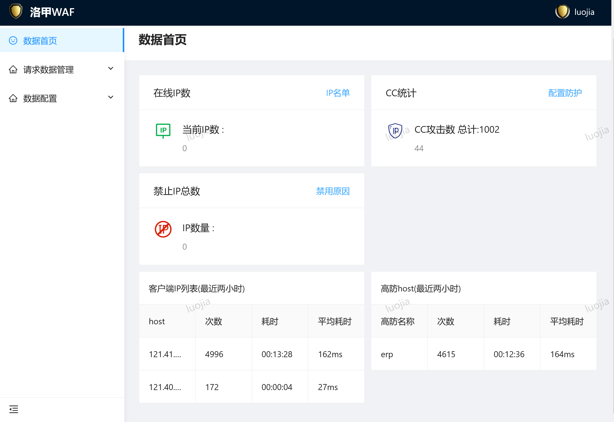
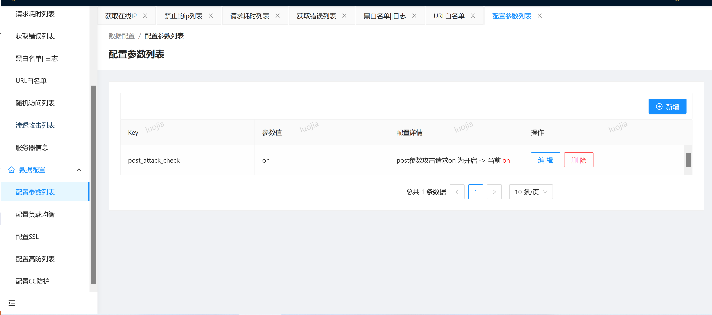
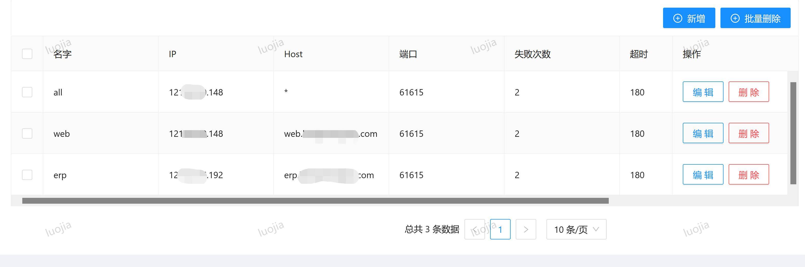
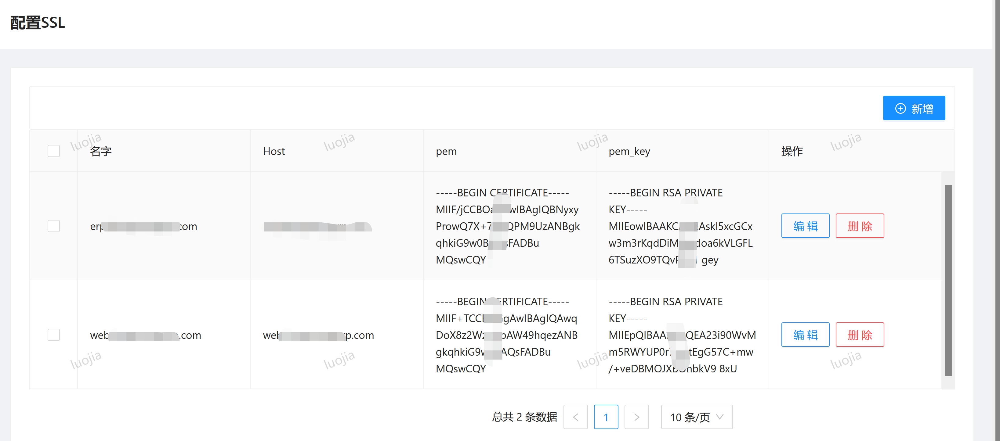
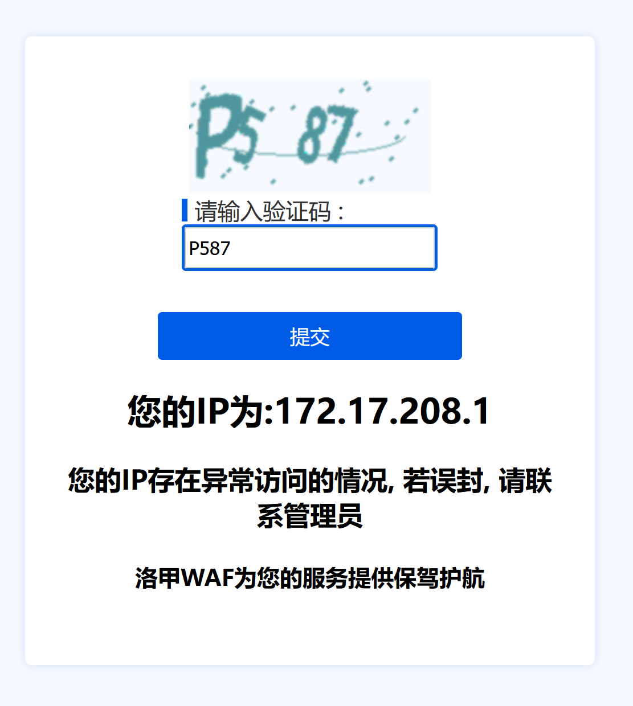

# 洛甲WAF
> 基于openresty的web防火墙，通过配合后台保护您的数据安全

## 项目说明
> 由于普通的web防火墙通常只是单台的限制, 并不能对集群中的流量进行全局的分析
> 从而无法达到有效的防止cc的攻击, 攻击者可分散攻击而让单台无法分析出其是否是恶意的攻击
> 所以需要有中台的分析,才能有效的判断是否为恶意IP,从而进行限制

## 系统组成部分
系统由[节点服务器 luojiawaf_lua(nginx+lua) ](https://gitee.com/tickbh/luojiawaf_lua)和
[中控服务器后端 luajiawaf_server(django) ](https://gitee.com/tickbh/luojiawaf_server)组成, 数据由用户在中控服务器修改,然后由中控服务器同步到节点服务器, 数据更新完毕

#### 配置
在compose/luojia.json配置相应的服务器id和redis地址
配置将通过后台, 共享redis配置, 从redis中读出最新的配置, 包括负载均衡, 黑白名单, 限制内容等参数

### 快速开始  
docker部署,
直接进入compose目录,执行
```
docker-compose start
```
重启则直接运行
```
reload_nginx.sh
```

#### 产品实现功能
- 可自动对CC进行拉黑
- 可在后台配置限制访问频率,URI访问频率
- 可后台封禁IP,记录IP访问列表
- 对指定HOST限制流入流出流量或者对全局限制
- 可统计服务端错误内容500错误等
- 可查看请求耗时列表, 服务器内部负载情况
- 可在后台配置负载均衡, 添加域名转发, 无需重启服务器
- 可在后台配置SSL证书, 无需重启服务器
- 对黑名单的用户,如果频繁访问,则防火墙对IP封禁
- 对GET或者POST参数进行检查, 防止SQL注入
- 对指定时间, 或者指定星期进行限制, 防止高峰期流量过载
- 针对封禁的IP,可以配置记录请求信息, 可以有效的分析攻击时的记录
- 针对解发风控的IP, 可以选择人机验证模式, 保证不会被误封

### 产品展示图
##### 主页

##### 配置

##### 负载均衡

##### SSL证书

##### 行为验证码



### 相关连接
> 国内访问

[节点服务器 luojiawaf_lua(nginx+lua) ](https://gitee.com/tickbh/luojiawaf_lua)

[中控服务器前端 luajiawaf_web(ant.design) ](https://gitee.com/tickbh/luojiawaf_web)

[中控服务器后端 luajiawaf_server(django) ](https://gitee.com/tickbh/luojiawaf_server)

> GITHUB

[节点服务器 luojiawaf_lua(nginx+lua) ](https://github.com/tickbh/luojiawaf_lua)

[中控服务器前端 luajiawaf_web(ant.design) ](https://github.com/tickbh/luojiawaf_web)

[中控服务器后端 luajiawaf_server(django) ](https://github.com/tickbh/luojiawaf_server)

## 💬 社区交流

##### QQ交流群

加QQ群号 684772704, 验证信息: luojiawaf
